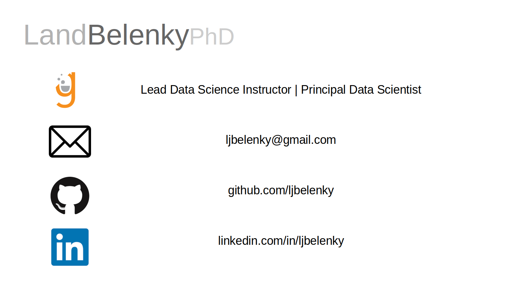

## Selected Works

### Foundations of Data Science
* [Introduction to Python](https://bit.ly/Land_python)
* [Math Essential for Data Science](https://bit.ly/Land_python)
* [Statistics and Probabiltiy for Data Science](https://bit.ly/Land_stats)
* [Introduction to Object Oriented Programming in Python](https://bit.ly/Land_OOP)

### Applications of Data Science
* [How do You Solve a Problem Like Murphy?](https://bit.ly/Land_Murphy)
* [Hybrid Unsupervised-Supervised Machine Learning for Time Series Analysis](https://github.com/ljbelenky/decline)

### Example Templates for Students
* [Time Series - MA Models](https://gist.github.com/ljbelenky/f1ad1fe5520efa842ff40fbe5ab9f5fc)
* Time Series - ARIMA Models
* Sklearn Pipelines

